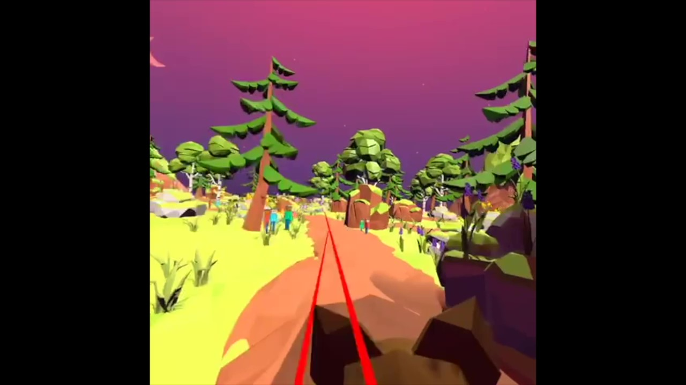

# VR Bat Game

VR Bat Game is a interactable VR Game created by using Unity. In this game, you will be flying as a bat in a beautiful twilight scenery and you can use the grab feature of the controller to catch mosquitoes. 

The playing demo is in the video called Bat_Game_Video.mp4. 



## Installation 

To install the game to your VR set, you first need to download the file. 

```
FINAL bat game build.apk 
```

If your VR set is Oculus Quest, you can download SideQuest to install the apk package. The tutorial for SideQuest is easy to find online. 

The orignal Unity Project is too large to upload to GitHub. If you are interested in it, please contact me. 

## Contribution

I contributed to this project as a volunteer and collaberated with a group in the University of Texas at Austin(Amanda, Fanyi, Ishita, Nimra, Soojin). 
I mainly designed and created

* ### embed mosquito and its animation to the scene
* ### interaction feature(grab the mosquitoes and destroy it after you release the grab button) 
* ### the sound effect of grabing successfully and the noise made by mosquitoes

